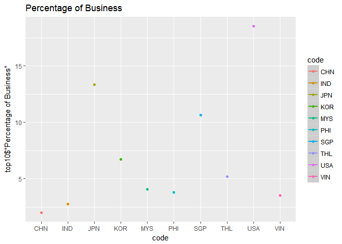
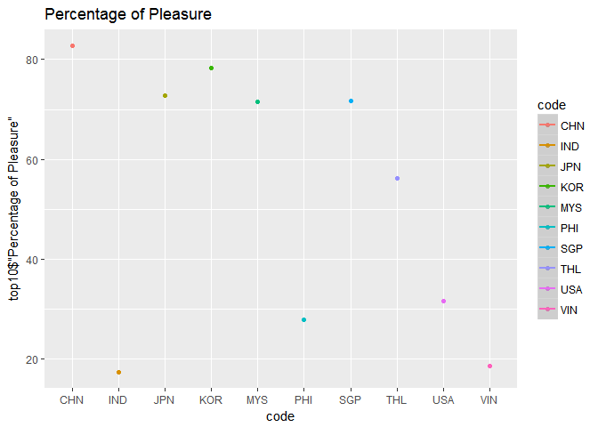

外國人來台灣數量及目的分析
================

分析議題背景
------------

組員姓名 B0344126鄭筠臻、B0344129葉亞萱 在地球村的時代，每年哪一國人最常來台灣呢，來台灣又有哪些目的呢

分析動機
--------

台灣是觀光勝地，想了解那些世界各國來台灣，找出前三名，找出與台灣密切往來的國家，並了解其目的，分析目的主要原因為何?例如：業務、觀光、探親、會議、求學、展覽、醫療……等等。想透過大數據R語言解釋出台灣在世界各國的重要性。

使用資料
--------

<http://admin.taiwan.net.tw/statistics/year.aspx?no=134>

載入使用資料們

``` r
library(readr)
country <- read_csv("C:/Users/Eileen/Desktop/country.csv")
```

    ## Warning: Missing column names filled in: 'X1' [1]

    ## Parsed with column specification:
    ## cols(
    ##   X1 = col_character(),
    ##   x_2011 = col_number(),
    ##   x_2012 = col_number(),
    ##   x_2013 = col_number(),
    ##   x_2014 = col_number(),
    ##   x_2015 = col_number(),
    ##   x_2016 = col_number()
    ## )

``` r
View(country)
country$X1<-
  iconv(country$X1,
        from="big5", to = "UTF-8")
library(readr)
purpose <- read_csv("C:/Users/Eileen/Desktop/purpose.csv")
```

    ## Warning: Missing column names filled in: 'X1' [1]

    ## Parsed with column specification:
    ## cols(
    ##   X1 = col_character(),
    ##   Total = col_number(),
    ##   Business = col_number(),
    ##   Pleasure = col_number(),
    ##   VisitRelatives = col_number(),
    ##   Conference = col_number(),
    ##   Study = col_number(),
    ##   Exhibition = col_number(),
    ##   MedicalTreatment = col_number(),
    ##   Others = col_number()
    ## )

``` r
View(purpose)
purpose$X1<-
  iconv(purpose$X1,
        from="big5", to = "UTF-8")
```

資料處理與清洗
--------------

先取出105年前三名的人數資料，再把兩個表合起來，然後再把資料轉成數值，再算出比例，就可以知道前三名的國家來台灣大多是為了旅遊，洽公或是其他原因

處理資料

``` r
country1<-head(country[order(country$x_2016,decreasing = T),],3)
country1<-subset(country1,select = c(X1,x_2016))

library(knitr)
knitr::kable(
  country1[1:3,])
```

| X1                            |  x\_2016|
|:------------------------------|--------:|
| 日本 Japan                    |  1896456|
| 韓國 Korea,Republic of        |   887412|
| 美國 United States of America |   542261|

``` r
library(dplyr)
```

    ## 
    ## Attaching package: 'dplyr'

    ## The following objects are masked from 'package:stats':
    ## 
    ##     filter, lag

    ## The following objects are masked from 'package:base':
    ## 
    ##     intersect, setdiff, setequal, union

``` r
topthree<-inner_join(country1,purpose,)
```

    ## Joining, by = "X1"

``` r
knitr::kable(
  topthree[1:3,])
```

| X1                            |  x\_2016|    Total|  Business|  Pleasure|  VisitRelatives|  Conference|  Study|  Exhibition|  MedicalTreatment|  Others|
|:------------------------------|--------:|--------:|---------:|---------:|---------------:|-----------:|------:|-----------:|-----------------:|-------:|
| 日本 Japan                    |  1896456|  1895702|    253159|   1379233|           21403|       10572|   5707|        1245|               124|  224259|
| 韓國 Korea,Republic of        |   887412|   884397|     59578|    693224|           17791|        5727|   6112|        3125|                81|   98759|
| 美國 United States of America |   542261|   523888|     97081|    166044|          148645|        6434|   3983|         571|               397|  100733|

``` r
topthree$Total<-as.numeric(topthree$Total)
topthree$Business<-as.numeric(topthree$Business)
topthree$Pleasure<-as.numeric(topthree$Pleasure)
topthree$VisitRelatives<-as.numeric(topthree$VisitRelatives)
topthree$Conference<-as.numeric(topthree$Conference)
topthree$Study<-as.numeric(topthree$Study)
topthree$Exhibition<-as.numeric(topthree$Exhibition)
topthree$MedicalTreatment<-as.numeric(topthree$MedicalTreatment)
topthree$Others<-as.numeric(topthree$Others)
topthree$'商務比例'<-topthree$Business/topthree$Total
topthree$'觀光比例'<-topthree$Pleasure/topthree$Total
topthree$'探親比例'<-topthree$VisitRelatives/topthree$Total
topthree$'會議比例'<-topthree$Conference/topthree$Total
topthree$'求學比例'<-topthree$Study/topthree$Total
topthree$'展覽比例'<-topthree$Exhibition/topthree$Total
topthree$'醫學比例'<-topthree$MedicalTreatment/topthree$Total
topthree$'其他比例'<-topthree$Others/topthree$Total
topthree$'國家'<-topthree$'X1'

topthree1<-subset(topthree,select = c('國家','商務比例','觀光比例','探親比例','會議比例','求學比例','展覽比例','醫學比例','其他比例'))
library(knitr)
knitr::kable(
  topthree1[1:3,]) 
```

| 國家                          |  商務比例 |  觀光比例 |  探親比例 |  會議比例 |  求學比例 |  展覽比例 |  醫學比例 |  其他比例 |
|:------------------------------|:---------:|:---------:|:---------:|:---------:|:---------:|:---------:|:---------:|:---------:|
| 日本 Japan                    | 0.1335437 | 0.7275579 | 0.0112903 | 0.0055768 | 0.0030105 | 0.0006567 | 0.0000654 | 0.1182987 |
| 韓國 Korea,Republic of        | 0.0673657 | 0.7838380 | 0.0201165 | 0.0064756 | 0.0069109 | 0.0035335 | 0.0000916 | 0.1116682 |
| 美國 United States of America | 0.1853087 | 0.3169456 | 0.2837343 | 0.0122813 | 0.0076028 | 0.0010899 | 0.0007578 | 0.1922796 |

探索式資料分析
--------------

美國人來台灣商務比例最高，但觀光比例卻最低，探親比例也比日韓高出滿多，會議也是美國最高，展覽則是韓國最高，由此可以知道，美國和台灣主要是商業合作相較於旅遊非常熱絡，韓國來台展覽多因為台灣人很哈韓，韓國來台灣辦演唱會、展覽利潤很高

``` r
library(ggplot2)

ggplot()+geom_bar(data=topthree1,
                  aes(x=國家,y=商務比例),
                  stat = "identity")
```



``` r
ggplot()+geom_bar(data=topthree1,
                  aes(x=國家,y=觀光比例),
                  stat = "identity")
```



``` r
ggplot()+geom_bar(data=topthree1,
                  aes(x=國家,y=探親比例),
                  stat = "identity")
```


``` r
ggplot()+geom_bar(data=topthree1,
                  aes(x=國家,y=會議比例),
                  stat = "identity")
```


``` r
ggplot()+geom_bar(data=topthree1,
                  aes(x=國家,y=求學比例),
                  stat = "identity")
```


``` r
ggplot()+geom_bar(data=topthree1,
                  aes(x=國家,y=展覽比例),
                  stat = "identity")
```


``` r
ggplot()+geom_bar(data=topthree1,
                  aes(x=國家,y=醫學比例),
                  stat = "identity")
```


``` r
ggplot()+geom_bar(data=topthree1,
                  aes(x=國家,y=其他比例),
                  stat = "identity")
```


期末專題分析規劃
----------------

期末專題時希望可以做出包含性別、年齡、以及對台灣觀光貢獻分析，外國人最愛旅遊地點分析等等。
