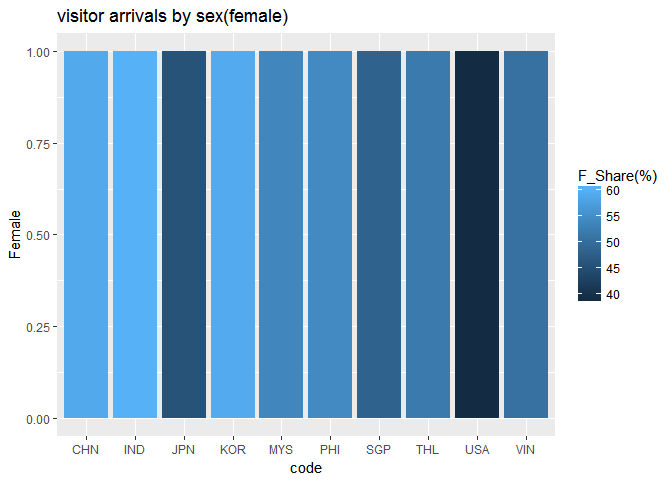

外國人來台灣數量及外配分析
================

分析議題背景
------------

組員姓名 B0344126鄭筠臻、B0344129葉亞萱 在地球村的時代，每年哪一國人最常來台灣呢，來台灣又有哪些目的呢? 想知道台灣的新住民與外國人來台目的的關係!

分析動機
--------

台灣是觀光勝地，想了解那些世界各國來台灣，找出前10名，找出與台灣密切往來的國家，並了解其目的，分析目的主要原因為何?例如：業務、觀光、探親、會議、求學、展覽、醫療……等等。想透過大數據R語言解釋出台灣在世界各國的重要性。

使用資料
--------

<http://admin.taiwan.net.tw/statistics/year.aspx?no=134>

載入使用資料們

``` r
library(readr)
```

    ## Warning: package 'readr' was built under R version 3.3.3

``` r
country<- read_csv("C:/Users/X550LD/Desktop/visitor arrivals (2003-2016).csv")
```

    ## Warning: Missing column names filled in: 'X1' [1]

    ## Parsed with column specification:
    ## cols(
    ##   X1 = col_character(),
    ##   X_2002 = col_integer(),
    ##   X_2003 = col_number(),
    ##   X_2004 = col_number(),
    ##   X_2005 = col_number(),
    ##   X_2006 = col_number(),
    ##   X_2007 = col_character(),
    ##   X_2008 = col_character(),
    ##   X_2009 = col_character(),
    ##   X_2010 = col_number(),
    ##   X_2011 = col_number(),
    ##   X_2012 = col_number(),
    ##   X_2013 = col_number(),
    ##   X_2014 = col_number(),
    ##   X_2015 = col_number(),
    ##   X_2016 = col_number()
    ## )

``` r
View(country)
country$X1<-
  iconv(country$X1,
        from="big5", to = "UTF-8")

library(readr)
purpose_2016 <- read_csv("C:/Users/X550LD/Desktop/visitor arrivals by purpose(2016) .csv")
```

    ## Parsed with column specification:
    ## cols(
    ##   Residence = col_character(),
    ##   Total = col_number(),
    ##   Business = col_number(),
    ##   Pleasure = col_number(),
    ##   VisitRelatives = col_number(),
    ##   Conference = col_number(),
    ##   Study = col_number(),
    ##   Exhibition = col_number(),
    ##   MedicalTreatment = col_number(),
    ##   Others = col_number()
    ## )

``` r
View(purpose_2016)

purpose_2016$Residence<-
  iconv(purpose_2016$Residence,
        from="big5", to = "UTF-8")
```

資料處理與清洗
--------------

取出2016年，來台人數的資料，再把兩個表合起來，找出那些國家是前10名。

``` r
library(readr)
countrycode <- read_csv("C:/Users/X550LD/Desktop/Code.csv")
```

    ## Parsed with column specification:
    ## cols(
    ##   Residence = col_character(),
    ##   code = col_character()
    ## )

``` r
View(countrycode)
countrycode$Residence<-
  iconv(countrycode$Residence,
        from="big5", to = "UTF-8")

library(dplyr)
```

    ## Warning: package 'dplyr' was built under R version 3.3.3

    ## Warning: Installed Rcpp (0.12.10) different from Rcpp used to build dplyr (0.12.11).
    ## Please reinstall dplyr to avoid random crashes or undefined behavior.

    ## 
    ## Attaching package: 'dplyr'

    ## The following objects are masked from 'package:stats':
    ## 
    ##     filter, lag

    ## The following objects are masked from 'package:base':
    ## 
    ##     intersect, setdiff, setequal, union

``` r
purpose_2016_code<-inner_join(purpose_2016,countrycode, by = "Residence")

library(treemap)
```

    ## Warning: package 'treemap' was built under R version 3.3.3

``` r
data(purpose_2016_code)
```

    ## Warning in data(purpose_2016_code): data set 'purpose_2016_code' not found

``` r
treemap(purpose_2016_code,
       index=c("code"), 
       vSize="Total", 
       vColor="Total", 
       type="value")
```


``` r
library(knitr)
knitr::kable(
  purpose_2016_code[1:10,1:2])
```

| Residence                        |                                                          Total|
|:---------------------------------|--------------------------------------------------------------:|
| 中國大陸(含港澳) China           |                                                        5126537|
| 日本 Japan                       |                                                        1895702|
| 韓國 Korea,Republic of           |                                                         884397|
| 馬來西亞 Malaysia                |                                                         474420|
| 新加坡 Singapore                 |                                                         407267|
| 印尼 Indonesia                   |                                                         188720|
| 菲律賓 Philippines               |                                                         172475|
| 泰國 Thailand                    |                                                         195640|
| 越南 Vietnam                     |                                                         196636|
| 美國 United States of America    |                                                         523888|
| \#\# 資料處理與清洗              |                                                               |
| 把資料轉成數值，再算出各個比例， |  就可以知道前10名的國家來台灣大多是為了旅遊，洽公或是其他原因?|
| 處理資料                         |                                                               |

``` r
country10<-head(country[order(country$X_2016,decreasing = T),],10)
country10<-subset(country10,select = c(X1,X_2016))
library(dplyr)
top10<-inner_join(country10,purpose_2016_code,c("X1"="Residence"))

library(knitr)
knitr::kable(
  top10[1:10,])
```

| X1                            |  X\_2016|    Total|  Business|  Pleasure|  VisitRelatives|  Conference|  Study|  Exhibition|  MedicalTreatment|  Others| code |
|:------------------------------|--------:|--------:|---------:|---------:|---------------:|-----------:|------:|-----------:|-----------------:|-------:|:-----|
| 中國大陸(含港澳) China        |  4987259|  5126537|    102014|   4242780|          111667|        8775|  31104|         269|             33152|  596776| CHN  |
| 日本 Japan                    |  1896456|  1895702|    253159|   1379233|           21403|       10572|   5707|        1245|               124|  224259| JPN  |
| 韓國 Korea,Republic of        |   887412|   884397|     59578|    693224|           17791|        5727|   6112|        3125|                81|   98759| KOR  |
| 美國 United States of America |   542261|   523888|     97081|    166044|          148645|        6434|   3983|         571|               397|  100733| USA  |
| 馬來西亞 Malaysia             |   500496|   474420|     19269|    339710|           15475|        4569|   2211|        1540|               743|   90903| MYS  |
| 新加坡 Singapore              |   371663|   407267|     43378|    292240|           13931|        4472|   1839|         964|               189|   50254| SGP  |
| 越南 Vietnam                  |   194323|   196636|      6916|     36839|           17098|        1321|   1317|         318|               195|  132632| VIN  |
| 泰國 Thailand                 |   193200|   195640|     10179|    110116|            6652|        2490|   1367|         866|                94|   63876| THL  |
| 印尼 Indonesia                |   192053|   188720|      5201|     32868|            8626|        2019|   1752|         738|               530|  136986| IND  |
| 菲律賓 Philippines            |   171816|   172475|      6551|     48198|            4843|        3238|    591|         527|               255|  108272| PHI  |

``` r
top10$Total<-as.double(top10$Total)
top10$Business<-as.double(top10$Business)
top10$Pleasure<-as.double(top10$Pleasure)
top10$VisitRelatives<-as.double(top10$VisitRelatives)
top10$Conference<-as.double(top10$Conference)
top10$Study<-as.double(top10$Study)
top10$Exhibition<-as.double(top10$Exhibition)
top10$MedicalTreatment<-as.double(top10$MedicalTreatment)
top10$Others<-as.double(top10$Others)

top10$"Percentage of Business"<-top10$Business/top10$Total*100
top10$"Percentage of Pleasure"<-top10$Pleasure/top10$Total*100
top10$"Percentage of VisitRelatives"<-top10$VisitRelatives/top10$Total*100
top10$"Percentage of Conference"<-top10$Conference/top10$Total*100
top10$"Percentage of Study"<-top10$Study/top10$Total*100
top10$"Percentage of Exhibition"<-top10$Exhibition/top10$Total*100
top10$"Percentage of MedicalTreatment"<-top10$MedicalTreatment/top10$Total*100
top10$"Percentage of Others"<-top10$Others/top10$Total*100
top10$"Country"<-top10$'X1'

top10_purpose<-subset(top10,select = 
                        c("code","Percentage of Business","Percentage of Pleasure","Percentage of VisitRelatives","Percentage of Conference","Percentage of Study","Percentage of Exhibition","Percentage of MedicalTreatment","Percentage of Others"))
library(knitr)
knitr::kable(
  top10_purpose[1:10,])
```

| code |  Percentage of Business|  Percentage of Pleasure|  Percentage of VisitRelatives|  Percentage of Conference|  Percentage of Study|  Percentage of Exhibition|  Percentage of MedicalTreatment|  Percentage of Others|
|:-----|-----------------------:|-----------------------:|-----------------------------:|-------------------------:|--------------------:|-------------------------:|-------------------------------:|---------------------:|
| CHN  |                1.989920|                82.76113|                      2.178215|                 0.1711682|            0.6067254|                 0.0052472|                       0.6466744|              11.64092|
| JPN  |               13.354367|                72.75579|                      1.129028|                 0.5576826|            0.3010494|                 0.0656749|                       0.0065411|              11.82987|
| KOR  |                6.736567|                78.38380|                      2.011653|                 0.6475599|            0.6910923|                 0.3533481|                       0.0091588|              11.16682|
| USA  |               18.530869|                31.69456|                     28.373431|                 1.2281251|            0.7602770|                 0.1089928|                       0.0757796|              19.22796|
| MYS  |                4.061591|                71.60533|                      3.261878|                 0.9630707|            0.4660427|                 0.3246069|                       0.1566123|              19.16087|
| SGP  |               10.650998|                71.75637|                      3.420606|                 1.0980512|            0.4515465|                 0.2366998|                       0.0464069|              12.33933|
| VIN  |                3.517159|                18.73462|                      8.695254|                 0.6717997|            0.6697655|                 0.1617201|                       0.0991680|              67.45052|
| THL  |                5.202924|                56.28501|                      3.400123|                 1.2727459|            0.6987324|                 0.4426498|                       0.0480474|              32.64976|
| IND  |                2.755935|                17.41628|                      4.570793|                 1.0698389|            0.9283595|                 0.3910555|                       0.2808393|              72.58690|
| PHI  |                3.798232|                27.94492|                      2.807943|                 1.8773735|            0.3426584|                 0.3055515|                       0.1478475|              62.77547|

``` r
library(dplyr) 
library(ggplot2)
```

    ## Warning: package 'ggplot2' was built under R version 3.3.3

``` r
qplot(code, top10$"Percentage of Business", 
      data=top10_purpose,color=code,
      main = "Percentage of Business",
      geom = c("point", "smooth"))
```

    ## `geom_smooth()` using method = 'loess'


``` r
qplot(code, top10$"Percentage of Pleasure", data=top10_purpose,color=code,
      main = "Percentage of Pleasure",
      geom = c("point", "smooth"))
```

    ## `geom_smooth()` using method = 'loess'


``` r
qplot(code, top10$"Percentage of VisitRelatives", data=top10_purpose,color=code,
      main = "Percentage of VisitRelatives",
      geom = c("point", "smooth"))
```

    ## `geom_smooth()` using method = 'loess'


``` r
qplot(code, top10$"Percentage of Conference", data=top10_purpose,color=code,
      main = "Percentage of Conference",
      geom = c("point", "smooth"))
```

    ## `geom_smooth()` using method = 'loess'


``` r
qplot(code, top10$"Percentage of Study", data=top10_purpose,color=code,
      main = "Percentage of Study",
      geom = c("point", "smooth"))
```

    ## `geom_smooth()` using method = 'loess'


``` r
qplot(code, top10$"Percentage of Exhibition", data=top10_purpose,color=code,
      main = "Percentage of Exhibition",
      geom = c("point", "smooth"))
```

    ## `geom_smooth()` using method = 'loess'


``` r
qplot(code, top10$"Percentage of MedicalTreatment", data=top10_purpose,color=code,
      main = "Percentage of MedicalTreatment",
      geom = c("point", "smooth"))
```

    ## `geom_smooth()` using method = 'loess'


``` r
qplot(code, top10$"Percentage of Others", data=top10_purpose,color=code,
      main = "Percentage of Others",
      geom = c("point", "smooth"))
```

    ## `geom_smooth()` using method = 'loess'


探索式資料分析
--------------

美國人來台灣商務比例最高，但觀光比例卻最低，探親比例也比日韓高出滿多，會議也是美國最高，展覽則是韓國最高，由此可以知道，美國和台灣主要是商業合作相較於旅遊非常熱絡，韓國來台展覽多因為台灣人很哈韓，韓國來台灣辦演唱會、展覽利潤很高。

``` r
top10_purpose<-subset(top10,select = 
                        c("code","Business","Pleasure","VisitRelatives","Conference","Study","Exhibition","MedicalTreatment","Others"))
head(top10_purpose,9)
```

    ## # A tibble: 9 x 9
    ##    code Business Pleasure VisitRelatives Conference Study Exhibition
    ##   <chr>    <dbl>    <dbl>          <dbl>      <dbl> <dbl>      <dbl>
    ## 1   CHN   102014  4242780         111667       8775 31104        269
    ## 2   JPN   253159  1379233          21403      10572  5707       1245
    ## 3   KOR    59578   693224          17791       5727  6112       3125
    ## 4   USA    97081   166044         148645       6434  3983        571
    ## 5   MYS    19269   339710          15475       4569  2211       1540
    ## 6   SGP    43378   292240          13931       4472  1839        964
    ## 7   VIN     6916    36839          17098       1321  1317        318
    ## 8   THL    10179   110116           6652       2490  1367        866
    ## 9   IND     5201    32868           8626       2019  1752        738
    ## # ... with 2 more variables: MedicalTreatment <dbl>, Others <dbl>

``` r
library(reshape2)
```

    ## Warning: package 'reshape2' was built under R version 3.3.3

``` r
top10.m <- melt(top10_purpose,id.vars = "code") 
head(top10.m,10)
```

    ##    code variable  value
    ## 1   CHN Business 102014
    ## 2   JPN Business 253159
    ## 3   KOR Business  59578
    ## 4   USA Business  97081
    ## 5   MYS Business  19269
    ## 6   SGP Business  43378
    ## 7   VIN Business   6916
    ## 8   THL Business  10179
    ## 9   IND Business   5201
    ## 10  PHI Business   6551

``` r
library(ggplot2)

library(dplyr)
top10.s<-top10_purpose %>% 
    mutate_each(funs(scale), -code) 
```

    ## `mutate_each()` is deprecated.
    ## Use `mutate_all()`, `mutate_at()` or `mutate_if()` instead.
    ## To map `funs` over a selection of variables, use `mutate_at()`

    ## Warning: package 'bindrcpp' was built under R version 3.3.3

``` r
head(top10.s,2)
```

    ## # A tibble: 2 x 9
    ##    code  Business  Pleasure VisitRelatives Conference      Study
    ##   <chr>     <dbl>     <dbl>          <dbl>      <dbl>      <dbl>
    ## 1   CHN 0.5403874 2.6963171       1.491095   1.277753 2.78449848
    ## 2   JPN 2.4999390 0.4957499      -0.302179   1.879888 0.01186695
    ## # ... with 3 more variables: Exhibition <dbl>, MedicalTreatment <dbl>,
    ## #   Others <dbl>

``` r
top10.s.m <- melt(top10.s)
```

    ## Using code as id variables

    ## Warning: attributes are not identical across measure variables; they will
    ## be dropped

``` r
ggplot(top10.s.m, aes(variable, code)) + 
    geom_tile(aes(fill = value),
              colour = "#E6E6FA")+ 
    scale_fill_gradient(
        low = "#FFB6C1",high ="#DC143C")
```


``` r
library(readr)
sex_2016<- read_csv("C:/Users/X550LD/Desktop/visitor arrivals by sex(2016) .csv")
```

    ## Parsed with column specification:
    ## cols(
    ##   Residence = col_character(),
    ##   Total = col_number(),
    ##   Male = col_number(),
    ##   `M_Share(%)` = col_double(),
    ##   Female = col_number(),
    ##   `F_Share(%)` = col_double()
    ## )

``` r
View(sex_2016)
sex_2016$Residence<-
  iconv(sex_2016$Residence,
        from="big5", to = "UTF-8")
top10_male_female<- 
  head(sex_2016[order(sex_2016$Total,decreasing = T),],10)
library(dplyr)
top10_male_female_code<-inner_join(countrycode,top10_male_female,by="Residence")
library(knitr)
knitr::kable(
  top10_male_female_code[1:10,])
```

| Residence                     | code |    Total|     Male|  M\_Share(%)|   Female|  F\_Share(%)|
|:------------------------------|:-----|--------:|--------:|------------:|--------:|------------:|
| 中國大陸(含港澳) China        | CHN  |  5126537|  2125134|        41.45|  3001403|        59.00|
| 日本 Japan                    | JPN  |  1895702|  1031547|        54.42|   864155|        45.58|
| 韓國 Korea,Republic of        | KOR  |   884397|   362395|        40.98|   522002|        59.02|
| 美國 United States of America | USA  |   523888|   321319|        61.33|   202569|        38.67|
| 馬來西亞 Malaysia             | MYS  |   474420|   219401|        46.25|   255019|        53.75|
| 新加坡 Singapore              | SGP  |   407267|   211564|        51.95|   195703|        48.05|
| 越南 Vietnam                  | VIN  |   196636|    97347|        49.51|    99289|        50.49|
| 泰國 Thailand                 | THL  |   195640|    94269|        48.18|   101371|        51.82|
| 印尼 Indonesia                | IND  |   188720|    75429|        39.97|   113291|        60.03|
| 菲律賓 Philippines            | PHI  |   172475|    78887|        45.74|    93588|        54.26|

``` r
library(ggplot2)
qplotmale<-
  qplot(x=code,                      
      data=top10_male_female_code,              
      geom="bar",             
      main = "visitor arrivals by sex(male) ",  
      xlab="code",  
      ylab = "Male",
      fill= `M_Share(%)`)
qplotmale
```


``` r
library(ggplot2)
qplotfemale<- 
  qplot(x=code,                      
      data=top10_male_female_code,              
      geom="bar",             
      main = "visitor arrivals by sex(female) ",  
      xlab="code",
      ylab = "Female",
      fill=`F_Share(%)`)
qplotfemale
```



``` r
library(readr)
reason <- read_csv("C:/Users/X550LD/Desktop/reason.csv")
```

    ## Parsed with column specification:
    ## cols(
    ##   abc = col_character(),
    ##   application_boy = col_number(),
    ##   application_girl = col_number(),
    ##   application_total = col_number(),
    ##   license_boy = col_number(),
    ##   license_girl = col_number(),
    ##   license_total = col_number(),
    ##   out_of_country_boy = col_number(),
    ##   out_of_country_girl = col_number(),
    ##   out_of_country_total = col_number(),
    ##   immigration_boy = col_number(),
    ##   immigration_girl = col_number(),
    ##   immigration_total = col_number()
    ## )

``` r
View(reason)
library(data.table)
```

    ## 
    ## Attaching package: 'data.table'

    ## The following objects are masked from 'package:reshape2':
    ## 
    ##     dcast, melt

    ## The following objects are masked from 'package:dplyr':
    ## 
    ##     between, first, last

``` r
reason<-data.table(reason)
reason<-head(reason[order(reason$immigration_total,decreasing = T),],13)
reason<-subset(reason,select = c(abc,immigration_total))
library(knitr)
knitr::kable(
  reason[1:13,])
```

| abc                    |  immigration\_total|
|:-----------------------|-------------------:|
| 觀光合計               |             2736053|
| 一類觀光               |             1347433|
| 個人旅遊               |             1308601|
| 小三通(往來金、馬、澎) |              255795|
| 其他                   |              231523|
| 專業交流合計           |              133461|
| 短期專業交流           |               96539|
| 商務交流合計           |               87729|
| 三類觀光               |               80019|
| 短期商務活動交流       |               78811|
| 研修生                 |               32648|
| 健檢醫美               |               28112|
| 履約活動               |                5252|

``` r
classification<-reason[grepl('合計',abc)]
library(knitr)
knitr::kable(
  classification[1:3,])
```

| abc          |  immigration\_total|
|:-------------|-------------------:|
| 觀光合計     |             2736053|
| 專業交流合計 |              133461|
| 商務交流合計 |               87729|

``` r
library(readr)
foreign_spouse <- read_csv("C:/Users/X550LD/Desktop/foreign_spouse.csv")
```

    ## Warning: Missing column names filled in: 'X1' [1]

    ## Parsed with column specification:
    ## cols(
    ##   .default = col_number(),
    ##   X1 = col_character(),
    ##   boy96 = col_integer(),
    ##   boy97 = col_integer(),
    ##   boy98 = col_integer(),
    ##   boy99 = col_integer(),
    ##   boy100 = col_integer(),
    ##   boy101 = col_integer(),
    ##   boy102 = col_integer(),
    ##   boy103 = col_integer(),
    ##   boy104 = col_integer(),
    ##   boy105 = col_integer()
    ## )

    ## See spec(...) for full column specifications.

``` r
View(foreign_spouse)
foreign_spouse$'total105'<-as.numeric(foreign_spouse$'total105')
foreign_spouse<-head(foreign_spouse[order(foreign_spouse$'total105',decreasing = T),],5)
foreign_spouse<-subset(foreign_spouse,select = c('X1','total105','boy105','girl105'))
library(knitr)
knitr::kable(
  foreign_spouse[1:5,])
```

| X1       |  total105|  boy105|  girl105|
|:---------|---------:|-------:|--------:|
| 越南     |      1968|      21|     1947|
| 印尼     |       337|      19|      318|
| 泰國     |       277|       2|      275|
| 菲律賓   |       258|      16|      242|
| 馬來西亞 |        23|       7|       16|

``` r
library(ggplot2) 
qplot(boy105,girl105, 
      data = foreign_spouse)
```


``` r
library(ggplot2)
ggplot(data=reason) +   
  geom_point(aes(x=abc, 
                 y=immigration_total,
                 main="中國人來台原因",
                 color=abc,
                 size=5)) + 
  labs(title="中國人來台原因",
       x="原因",
       y="人數") + theme_bw()
```

    ## Warning: Ignoring unknown aesthetics: main


``` r
ggplot(data=foreign_spouse) +   
  geom_point(aes(x=X1, 
                 y=total105,
                 main="105外籍配偶",
                 color=X1,
                 size=5)) + 
  labs(title="105外籍配偶",
       x="國家",
       y="人數") + theme_bw()
```

    ## Warning: Ignoring unknown aesthetics: main

 \#\# 期末專題分析規劃 期末專題時希望可以做出包含性別、年齡、以及對台灣外籍配偶分析，我國人吸引外籍來台分析等等。
