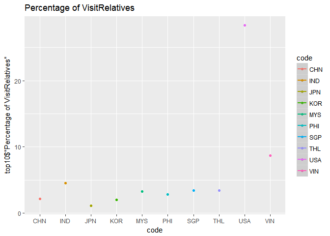
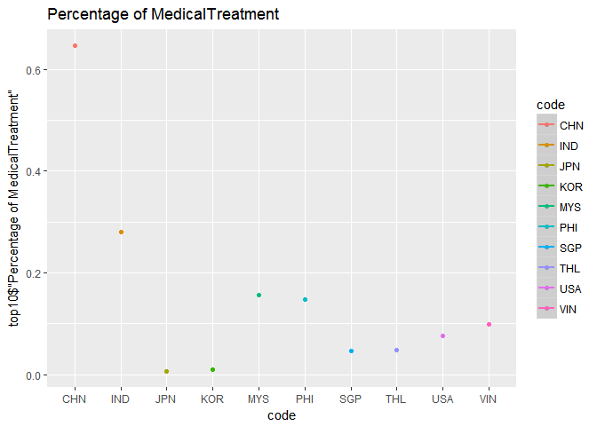
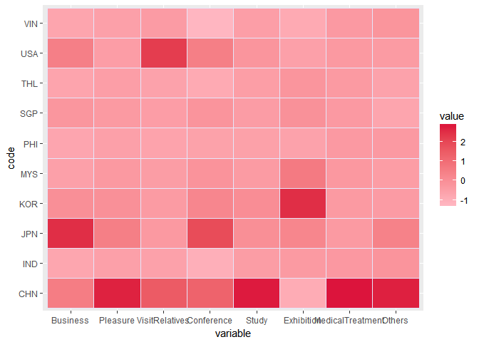
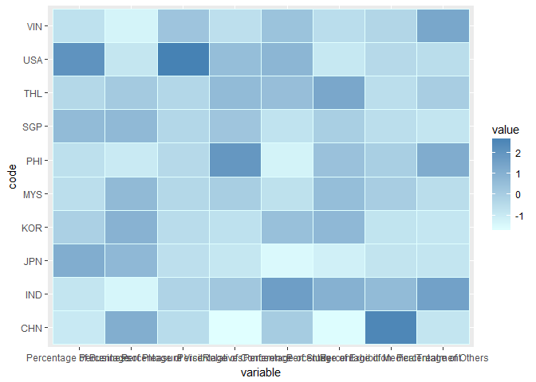
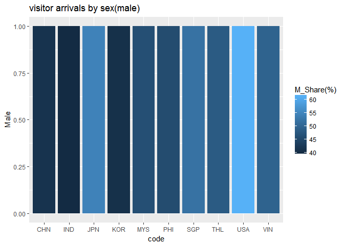

外國人來台灣數量及目的分析
================

分析議題背景
------------

組員姓名 B0344126鄭筠臻、B0344129葉亞萱 在地球村的時代，每年哪一國人最常來台灣呢，來台灣又有哪些目的呢

分析動機
--------

台灣是觀光勝地，想了解那些世界各國來台灣，找出前三名，找出與台灣密切往來的國家，並了解其目的，分析目的主要原因為何?例如：業務、觀光、探親、會議、求學、展覽、醫療……等等。想透過大數據R語言解釋出台灣在世界各國的重要性。

使用資料
--------

<http://admin.taiwan.net.tw/statistics/year.aspx?no=134>

載入使用資料們

``` r
installed.packages("iconv")
```

    ##      Package LibPath Version Priority Depends Imports LinkingTo Suggests
    ##      Enhances License License_is_FOSS License_restricts_use OS_type Archs
    ##      MD5sum NeedsCompilation Built

``` r
library(readr)
```

    ## Warning: package 'readr' was built under R version 3.3.3

``` r
country<- read_csv("C:/Users/X550LD/Desktop/visitor arrivals (2003-2016).csv")
```

    ## Warning: Missing column names filled in: 'X1' [1]

    ## Parsed with column specification:
    ## cols(
    ##   X1 = col_character(),
    ##   X_2002 = col_integer(),
    ##   X_2003 = col_number(),
    ##   X_2004 = col_number(),
    ##   X_2005 = col_number(),
    ##   X_2006 = col_number(),
    ##   X_2007 = col_character(),
    ##   X_2008 = col_character(),
    ##   X_2009 = col_character(),
    ##   X_2010 = col_number(),
    ##   X_2011 = col_number(),
    ##   X_2012 = col_number(),
    ##   X_2013 = col_number(),
    ##   X_2014 = col_number(),
    ##   X_2015 = col_number(),
    ##   X_2016 = col_number()
    ## )

``` r
View(country)
country$X1<-
  iconv(country$X1,
        from="big5", to = "UTF-8")

library(readr)
purpose_2016 <- read_csv("C:/Users/X550LD/Desktop/visitor arrivals by purpose(2016) .csv")
```

    ## Parsed with column specification:
    ## cols(
    ##   Residence = col_character(),
    ##   Total = col_number(),
    ##   Business = col_number(),
    ##   Pleasure = col_number(),
    ##   VisitRelatives = col_number(),
    ##   Conference = col_number(),
    ##   Study = col_number(),
    ##   Exhibition = col_number(),
    ##   MedicalTreatment = col_number(),
    ##   Others = col_number()
    ## )

``` r
View(purpose_2016)
purpose_2016$Residence<-
  iconv(purpose_2016$Residence,
        from="big5", to = "UTF-8")
```

資料處理與清洗
--------------

先取出105年前10名的人數資料，再把兩個表合起來，然後再把資料轉成數值，再算出比例，就可以知道前三名的國家來台灣大多是為了旅遊，洽公或是其他原因

處理資料

``` r
library(treemap)
```

    ## Warning: package 'treemap' was built under R version 3.3.3

``` r
data(purpose_2016)
```

    ## Warning in data(purpose_2016): data set 'purpose_2016' not found

``` r
treemap(purpose_2016,
       index=c("Residence"), #分組依據
       vSize="Total", #區塊大小
       vColor="Total", #顏色深淺
       type="value")
```


``` r
country10<-head(country[order(country$X_2016,decreasing = T),],10)
country10<-subset(country10,select = c(X1,X_2016))
top10<-country10[,-2]
library(knitr)
knitr::kable(
  country10[1:10,])
```

| X1                            |  X\_2016|
|:------------------------------|--------:|
| 中國大陸(含港澳) China        |  4987259|
| 日本 Japan                    |  1896456|
| 韓國 Korea,Republic of        |   887412|
| 美國 United States of America |   542261|
| 馬來西亞 Malaysia             |   500496|
| 新加坡 Singapore              |   371663|
| 越南 Vietnam                  |   194323|
| 泰國 Thailand                 |   193200|
| 印尼 Indonesia                |   192053|
| 菲律賓 Philippines            |   171816|

``` r
library(dplyr)
```

    ## Warning: package 'dplyr' was built under R version 3.3.3

    ## Warning: Installed Rcpp (0.12.10) different from Rcpp used to build dplyr (0.12.11).
    ## Please reinstall dplyr to avoid random crashes or undefined behavior.

    ## 
    ## Attaching package: 'dplyr'

    ## The following objects are masked from 'package:stats':
    ## 
    ##     filter, lag

    ## The following objects are masked from 'package:base':
    ## 
    ##     intersect, setdiff, setequal, union

``` r
top10<-inner_join(top10,purpose_2016,c("X1"="Residence"))


knitr::kable(
  top10[1:10,])
```

| X1                            |    Total|  Business|  Pleasure|  VisitRelatives|  Conference|  Study|  Exhibition|  MedicalTreatment|  Others|
|:------------------------------|--------:|---------:|---------:|---------------:|-----------:|------:|-----------:|-----------------:|-------:|
| 中國大陸(含港澳) China        |  5126537|    102014|   4242780|          111667|        8775|  31104|         269|             33152|  596776|
| 日本 Japan                    |  1895702|    253159|   1379233|           21403|       10572|   5707|        1245|               124|  224259|
| 韓國 Korea,Republic of        |   884397|     59578|    693224|           17791|        5727|   6112|        3125|                81|   98759|
| 美國 United States of America |   523888|     97081|    166044|          148645|        6434|   3983|         571|               397|  100733|
| 馬來西亞 Malaysia             |   474420|     19269|    339710|           15475|        4569|   2211|        1540|               743|   90903|
| 新加坡 Singapore              |   407267|     43378|    292240|           13931|        4472|   1839|         964|               189|   50254|
| 越南 Vietnam                  |   196636|      6916|     36839|           17098|        1321|   1317|         318|               195|  132632|
| 泰國 Thailand                 |   195640|     10179|    110116|            6652|        2490|   1367|         866|                94|   63876|
| 印尼 Indonesia                |   188720|      5201|     32868|            8626|        2019|   1752|         738|               530|  136986|
| 菲律賓 Philippines            |   172475|      6551|     48198|            4843|        3238|    591|         527|               255|  108272|

``` r
top10$Total<-as.numeric(top10$Total)
top10$Business<-as.numeric(top10$Business)
top10$Pleasure<-as.numeric(top10$Pleasure)
top10$VisitRelatives<-as.numeric(top10$VisitRelatives)
top10$Conference<-as.numeric(top10$Conference)
top10$Study<-as.numeric(top10$Study)
top10$Exhibition<-as.numeric(top10$Exhibition)
top10$MedicalTreatment<-as.numeric(top10$MedicalTreatment)
top10$Others<-as.numeric(top10$Others)
top10$"Percentage of Business"<-top10$Business/top10$Total*100
top10$"Percentage of Pleasure"<-top10$Pleasure/top10$Total*100
top10$"Percentage of VisitRelatives"<-top10$VisitRelatives/top10$Total*100
top10$"Percentage of Conference"<-top10$Conference/top10$Total*100
top10$"Percentage of Study"<-top10$Study/top10$Total*100
top10$"Percentage of Exhibition"<-top10$Exhibition/top10$Total*100
top10$"Percentage of MedicalTreatment"<-top10$MedicalTreatment/top10$Total*100
top10$"Percentage of Others"<-top10$Others/top10$Total*100
top10$"Country"<-top10$'X1'

top10_purpose<-subset(top10,select = 
                        c("Country","Percentage of Business","Percentage of Pleasure","Percentage of VisitRelatives","Percentage of Conference","Percentage of Study","Percentage of Exhibition","Percentage of MedicalTreatment","Percentage of Others"))
library(knitr)
knitr::kable(
  top10_purpose[1:10,]) 
```

| Country                       |  Percentage of Business|  Percentage of Pleasure|  Percentage of VisitRelatives|  Percentage of Conference|  Percentage of Study|  Percentage of Exhibition|  Percentage of MedicalTreatment|  Percentage of Others|
|:------------------------------|-----------------------:|-----------------------:|-----------------------------:|-------------------------:|--------------------:|-------------------------:|-------------------------------:|---------------------:|
| 中國大陸(含港澳) China        |                1.989920|                82.76113|                      2.178215|                 0.1711682|            0.6067254|                 0.0052472|                       0.6466744|              11.64092|
| 日本 Japan                    |               13.354367|                72.75579|                      1.129028|                 0.5576826|            0.3010494|                 0.0656749|                       0.0065411|              11.82987|
| 韓國 Korea,Republic of        |                6.736567|                78.38380|                      2.011653|                 0.6475599|            0.6910923|                 0.3533481|                       0.0091588|              11.16682|
| 美國 United States of America |               18.530869|                31.69456|                     28.373431|                 1.2281251|            0.7602770|                 0.1089928|                       0.0757796|              19.22796|
| 馬來西亞 Malaysia             |                4.061591|                71.60533|                      3.261878|                 0.9630707|            0.4660427|                 0.3246069|                       0.1566123|              19.16087|
| 新加坡 Singapore              |               10.650998|                71.75637|                      3.420606|                 1.0980512|            0.4515465|                 0.2366998|                       0.0464069|              12.33933|
| 越南 Vietnam                  |                3.517159|                18.73462|                      8.695254|                 0.6717997|            0.6697655|                 0.1617201|                       0.0991680|              67.45052|
| 泰國 Thailand                 |                5.202924|                56.28501|                      3.400123|                 1.2727459|            0.6987324|                 0.4426498|                       0.0480474|              32.64976|
| 印尼 Indonesia                |                2.755935|                17.41628|                      4.570793|                 1.0698389|            0.9283595|                 0.3910555|                       0.2808393|              72.58690|
| 菲律賓 Philippines            |                3.798232|                27.94492|                      2.807943|                 1.8773735|            0.3426584|                 0.3055515|                       0.1478475|              62.77547|

``` r
library(ggplot2)
```

    ## Warning: package 'ggplot2' was built under R version 3.3.3

``` r
ggplot()+geom_bar(data=top10_purpose,
                  aes(x=Country,y="Percentage of Business"),
                  stat = "identity")
```


``` r
ggplot()+geom_bar(data=top10_purpose,
                  aes(x=Country,y="Percentage of Pleasure"),
                  stat = "identity")
```


``` r
ggplot()+geom_bar(data=top10_purpose,
                  aes(x=Country,y="Percentage of VisitRelatives"),
                  stat = "identity")
```



``` r
ggplot()+geom_bar(data=top10_purpose,
                  aes(x=Country,y="Percentage of Conference"),
                  stat = "identity")
```


``` r
ggplot()+geom_bar(data=top10_purpose,
                  aes(x=Country,y="Percentage of Study"),
                  stat = "identity")
```


``` r
ggplot()+geom_bar(data=top10_purpose,
                  aes(x=Country,y="Percentage of Exhibition"),
                  stat = "identity")
```


``` r
ggplot()+geom_bar(data=top10_purpose,
                  aes(x=Country,y="Percentage of MedicalTreatment"),
                  stat = "identity")
```



``` r
ggplot()+geom_bar(data=top10_purpose,
                  aes(x=Country,y="Percentage of Others"),
                  stat = "identity")
```


探索式資料分析
--------------

美國人來台灣商務比例最高，但觀光比例卻最低，探親比例也比日韓高出滿多，會議也是美國最高，展覽則是韓國最高，由此可以知道，美國和台灣主要是商業合作相較於旅遊非常熱絡，韓國來台展覽多因為台灣人很哈韓，韓國來台灣辦演唱會、展覽利潤很高

``` r
head(top10_purpose,9)
```

    ## # A tibble: 9 x 9
    ##                         Country `Percentage of Business`
    ##                           <chr>                    <dbl>
    ## 1        中國大陸(含港澳) China                 1.989920
    ## 2                    日本 Japan                13.354367
    ## 3        韓國 Korea,Republic of                 6.736567
    ## 4 美國 United States of America                18.530869
    ## 5             馬來西亞 Malaysia                 4.061591
    ## 6              新加坡 Singapore                10.650998
    ## 7                  越南 Vietnam                 3.517159
    ## 8                 泰國 Thailand                 5.202924
    ## 9                印尼 Indonesia                 2.755935
    ## # ... with 7 more variables: `Percentage of Pleasure` <dbl>, `Percentage
    ## #   of VisitRelatives` <dbl>, `Percentage of Conference` <dbl>,
    ## #   `Percentage of Study` <dbl>, `Percentage of Exhibition` <dbl>,
    ## #   `Percentage of MedicalTreatment` <dbl>, `Percentage of Others` <dbl>

``` r
library(reshape2)
```

    ## Warning: package 'reshape2' was built under R version 3.3.3

``` r
top10.m <- melt(top10_purpose,id.vars = "Country") 
head(top10.m,10)
```

    ##                          Country               variable     value
    ## 1         中國大陸(含港澳) China Percentage of Business  1.989920
    ## 2                     日本 Japan Percentage of Business 13.354367
    ## 3         韓國 Korea,Republic of Percentage of Business  6.736567
    ## 4  美國 United States of America Percentage of Business 18.530869
    ## 5              馬來西亞 Malaysia Percentage of Business  4.061591
    ## 6               新加坡 Singapore Percentage of Business 10.650998
    ## 7                   越南 Vietnam Percentage of Business  3.517159
    ## 8                  泰國 Thailand Percentage of Business  5.202924
    ## 9                 印尼 Indonesia Percentage of Business  2.755935
    ## 10            菲律賓 Philippines Percentage of Business  3.798232

``` r
library(ggplot2)
ggplot(top10.m, aes(variable, Country)) + 
    geom_tile(aes(fill = value),
              colour = "#E0FFFF")+ 
    scale_fill_gradient(
        low = "#E0FFFF",high = "steelblue")
```



``` r
library(dplyr)
top10.s<-top10_purpose %>% 
    mutate_each(funs(scale), -Country) 
```

    ## `mutate_each()` is deprecated.
    ## Use `mutate_all()`, `mutate_at()` or `mutate_if()` instead.
    ## To map `funs` over a selection of variables, use `mutate_at()`

    ## Warning: package 'bindrcpp' was built under R version 3.3.3

``` r
head(top10.s,2)
```

    ## # A tibble: 2 x 9
    ##                  Country `Percentage of Business` `Percentage of Pleasure`
    ##                    <chr>                    <dbl>                    <dbl>
    ## 1 中國大陸(含港澳) China               -0.9359917                 1.140935
    ## 2             日本 Japan                1.1620679                 0.758218
    ## # ... with 6 more variables: `Percentage of VisitRelatives` <dbl>,
    ## #   `Percentage of Conference` <dbl>, `Percentage of Study` <dbl>,
    ## #   `Percentage of Exhibition` <dbl>, `Percentage of
    ## #   MedicalTreatment` <dbl>, `Percentage of Others` <dbl>

``` r
top10.s.m <- melt(top10.s)
```

    ## Using Country as id variables

    ## Warning: attributes are not identical across measure variables; they will
    ## be dropped

``` r
ggplot(top10.s.m, aes(variable, Country)) + 
    geom_tile(aes(fill = value),
              colour = "#E0FFFF")+ 
    scale_fill_gradient(
        low = "#E0FFFF",high = "steelblue")
```



``` r
library(readr)
sex_2016<- read_csv("C:/Users/X550LD/Desktop/visitor arrivals by sex(2016) .csv")
```

    ## Parsed with column specification:
    ## cols(
    ##   Residence = col_character(),
    ##   Total = col_number(),
    ##   Male = col_number(),
    ##   `M_Share(%)` = col_double(),
    ##   Female = col_number(),
    ##   `F_Share(%)` = col_double()
    ## )

``` r
View(sex_2016)
sex_2016$Residence<-
  iconv(sex_2016$Residence,
        from="big5", to = "UTF-8")
top10_male_female<- 
  head(sex_2016[order(sex_2016$Total,decreasing = T),],10)

library(knitr)
knitr::kable(
  top10_male_female[1:10,])
```

| Residence                     |    Total|     Male|  M\_Share(%)|   Female|  F\_Share(%)|
|:------------------------------|--------:|--------:|------------:|--------:|------------:|
| 中國大陸(含港澳) China        |  5126537|  2125134|        41.45|  3001403|        59.00|
| 日本 Japan                    |  1895702|  1031547|        54.42|   864155|        45.58|
| 韓國 Korea,Republic of        |   884397|   362395|        40.98|   522002|        59.02|
| 美國 United States of America |   523888|   321319|        61.33|   202569|        38.67|
| 馬來西亞 Malaysia             |   474420|   219401|        46.25|   255019|        53.75|
| 新加坡 Singapore              |   407267|   211564|        51.95|   195703|        48.05|
| 越南 Vietnam                  |   196636|    97347|        49.51|    99289|        50.49|
| 泰國 Thailand                 |   195640|    94269|        48.18|   101371|        51.82|
| 印尼 Indonesia                |   188720|    75429|        39.97|   113291|        60.03|
| 菲律賓 Philippines            |   172475|    78887|        45.74|    93588|        54.26|

``` r
library(ggplot2)
qplot(x=Residence,                      
      data=top10_male_female,              
      geom="bar",             
      main = "visitor arrivals by sex(male) ",  
      xlab="Residence",  
      ylab = "Male",
      fill= `M_Share(%)`)
```



``` r
library(ggplot2)
qplot(x=Residence,                      
      data=top10_male_female,              
      geom="bar",             
      main = "visitor arrivals by sex(female) ",  
      xlab="Country",
      ylab = "Female",
      fill=`F_Share(%)`)
```

 \#\# 期末專題分析規劃 期末專題時希望可以做出包含性別、年齡、以及對台灣觀光貢獻分析，外國人最愛旅遊地點分析等等。
